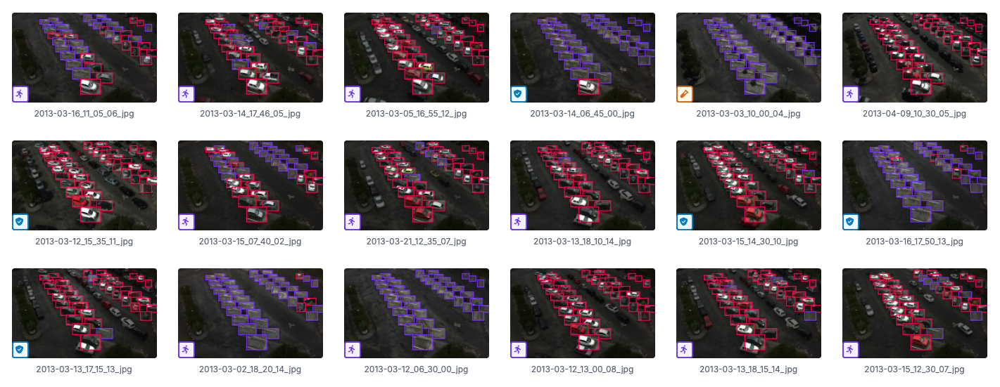
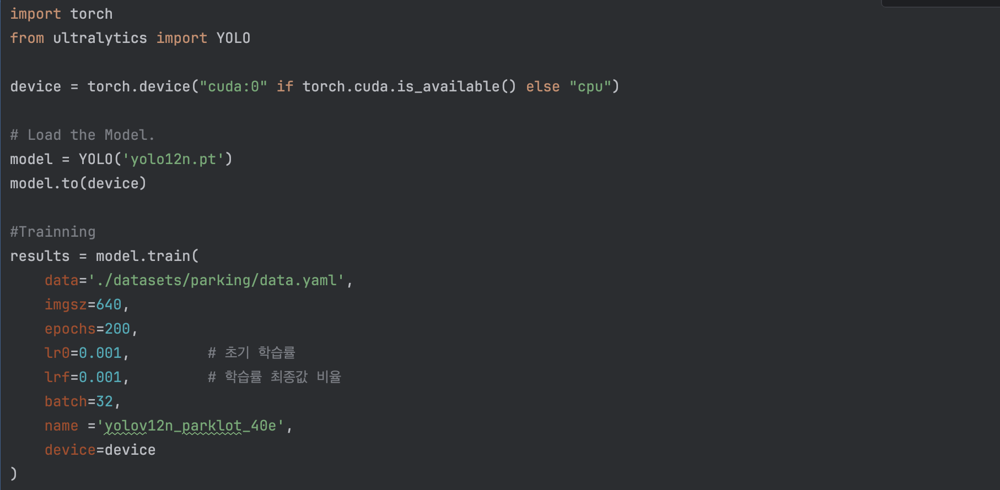
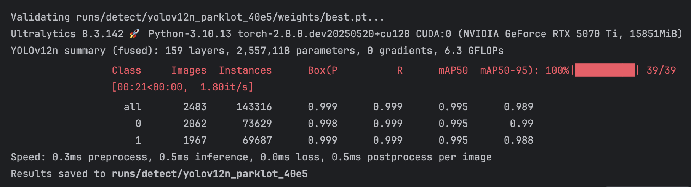
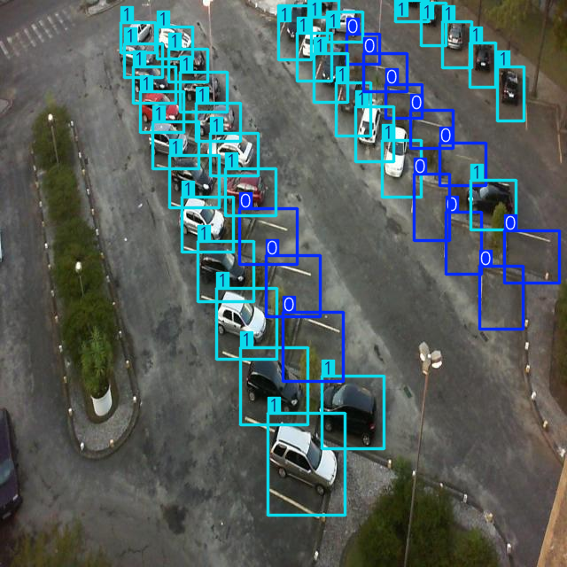

##  지능화캡스톤프로젝트 10주차 과제
### [Object Detection with Custom Datasets]
#### Roboflow를 활용하여 자신만의 데이터셋 구축
  - Train (>15), Valid(>5), Test(>5)
  - https://app.roboflow.com/image-classification-yzjok/capstonprj/browse?queryText=&pageSize=50&startingIndex=0&browseQuery=true
  - 
#### Ultralytics YOLO를 활용하여 yolo 모델(yolo8~11 중 선택) 학습
  - yolo12n최신 버전으로 학습진행
  - 
#### Validation 결과 mAP50, mAP50-95 도출
  - 
#### Test 이미지에 대한 결과 이미지 도출
  - 

## 결과물
### Object Detection with Custom Datasets.hwp
- 

#### 
# 충북대학교 산업인공지능학과 24학번 정현일
이메일 : chohi@chungbuk.ac.kr
